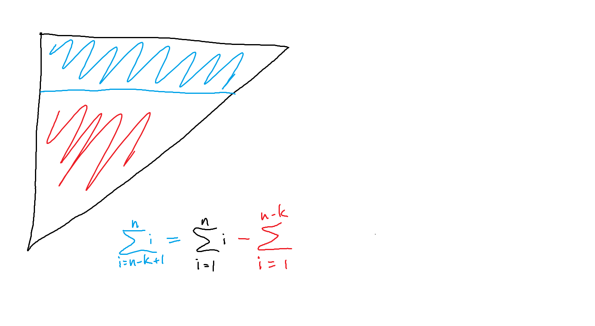
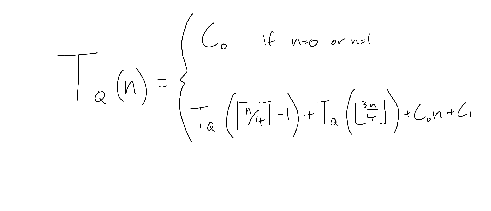
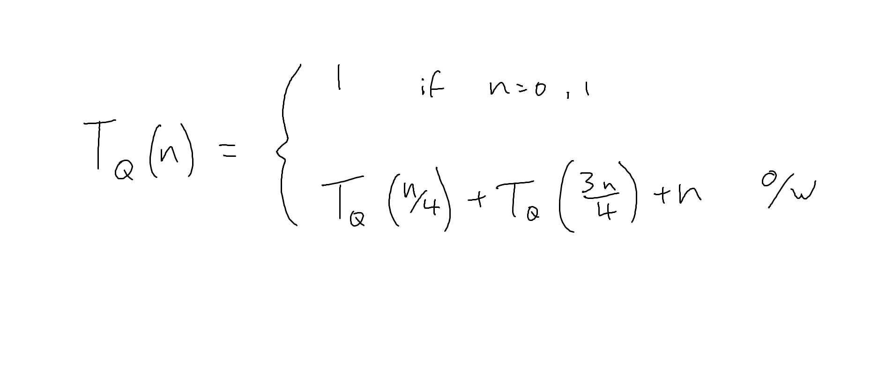
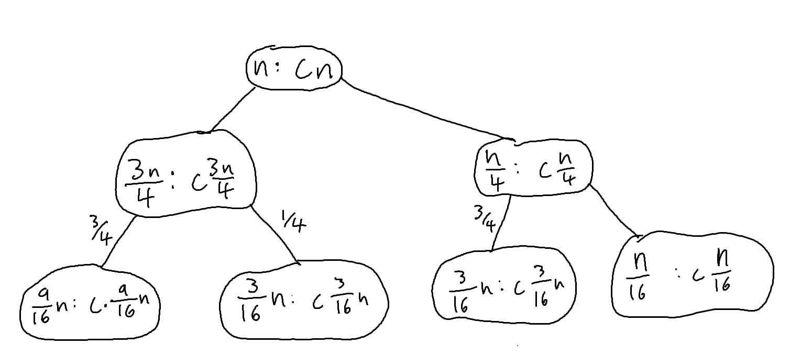

# Physics, Tug-o-War, and Divide-and-Conquer 18/10/2017

## Algorithmic Tug-o-War

```javascript
/**
 * Algorithm 1:
 * Scan for max + remove it
 */

while (k > 1) {
  // scan for max and remove it
  k--
}

/**
 * Algorithm 2:
 * Sort first, then return k'th largest
 */
```

---

**Algorithm 1 runtime**

n + (n - 1) + (n - 2) + ... + (n - k + 1)



= n(n+1)/2 - (n-k)(n-k+1)/2

= 2nk - k<sup>2</sup> + k

&le; 2nk + k &isin; O(nk)

---

**Algorithm 2 runtime**

O(nlog(n)) for sort, O(1) for k'th largest or O(k) if in linked list

---

## Analysing Quicksort

```typescript
// Assume all elements of A are unique.
function Quicksort(A: List) {
  if(A.length > 1) { // constant time
    let pivot = A[0] // select pivot point

    let lesser = A         // these take
    let greater = A[pivot - A.length] // time O(n)

    let lesserSorted = Quicksort(lesser)   // Ta(|lesser|)  // constant time
    let greaterSorted = Quicksort(greater) // Ta(|greater|) // O(n) ish

    return concat(lesserSorted, pivot, greaterSorted)
  }
  else {
    return A
  }
}
```

**Assume it gets lucky and always selects ciel(n/4)-th largest element as pivot,
what is recurrence relation for runtime?**

Basic:



Simplified:



Tree:



* choice of pivot is "Lucky", follows an algorithm as if known beforehand
