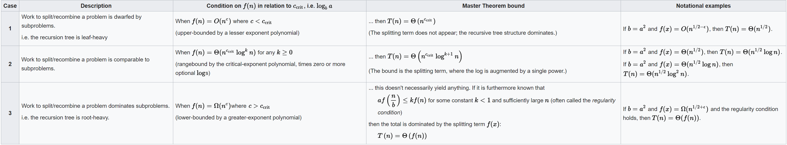

# TERMINOLOGY

**Full Tree**: all subchildren are empty or all are non-empty, and this is true
recursively.

**Magnitude**:

**Master Theorem**: Analysis for Divide and Conquer recursive problems, in the form:  
T(n) = aT(n/b) + f(n) where:  
n - input size  
f(n) - time taken at top level  
a - number of subproblems in the recursion  
b - factor by which each subproblem size is reduced  
c = critical exponent logba

**Greedy Algorithm**: Make a locally optimal decision at every stage of the
algorithm, which may not be optimal in the whole.

**Divide-and-Conquer Algorithm**: Multi-branched recursion. Split problem around
a 'pivot' and recurse using those chunks.

**Dynamic Programming**: 